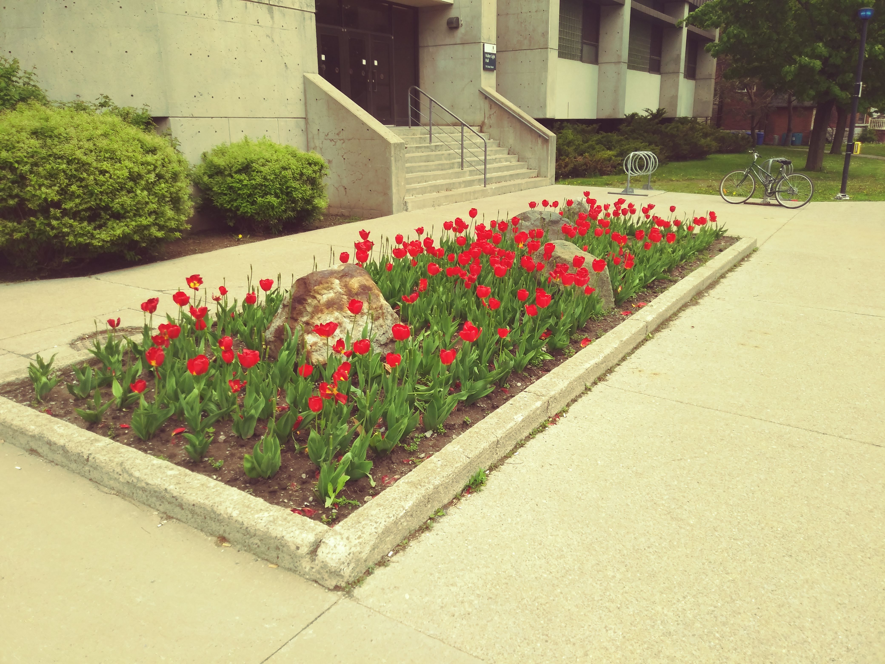

# Tulips At Queen's

Ahh, what a lovely sight. The bright colours of spring wash away the dirty snowbanks of Kingston, Ontario from memory.

## Skeleton Park

Kingston's downtown neighbourhoods bring with them a sense of communal living - twin homes each bringing their own character to the area. There is no better place to wander than the area surrounding skeleton park.
